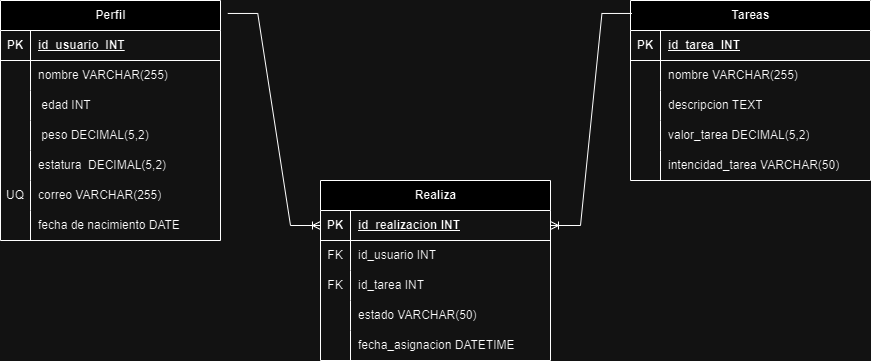

# Madre

    Madre" es una aplicación destinada a gestionar tareas domésticas en el hogar, permitiendo la creación de perfiles individuales para cada miembro, la asignación y programación de tareas según su frecuencia y nivel de esfuerzo, el uso de un sistema de puntaje para equilibrar la carga de trabajo, y el establecimiento de fechas y recordatorios para asegurar la finalización oportuna de las tareas. 

##  Perfil **ED**
    -id_usuario (PK) INT
    -nombre VARCHAR(255)
    -edad INT
    -peso DECIMAL(5,2)
    -correo (UQ) VARCHAR(255)
    -fecha de nacimiento DATE
    -estatura DECIMAL(5,2)

## Tareas **ED**
    -id_tarea (PK) INT
    -nombre VARCHAR(255)
    -descripcion TEXT
    -valor_tarea DECIMAL(5,2)
    -intencidad_tarea VARCHAR(50)

## Realiza: **EP**
    -id_realizacion (PK)INT
    -id_usuario (FK) INT
    -id_tarea (FK) INT
    -estado (pendiente, completada, en progreso, etc.) VARCHAR(50)
    -fecha_asignacion DATETIME
    

 ## Relaciones

    Un **usuario** realiza varias **tareas** (M_M)
    Una **tarea** puede ser realizada por un **usuarios** (M_M) 

   

   ### Reglas del negocio

## Perfil

- Crear un usuario: Registrar un nuevo usuario con nombre, edad, peso, correo, fecha de nacimiento y estatura.

- Actualizar un usuario: Modificar los datos de un usuario existente (nombre, edad, peso, correo, fecha de nacimiento, estatura).

- Eliminar un usuario: Borrar un usuario del sistema.

## Tarea

- Crear una tarea: Registrar una nueva tarea con nombre, descripción, valor y intensidad.

- Actualizar una tarea: Modificar los datos de una tarea existente (nombre, descripción, valor y intensidad).

- Eliminar una tarea: Borrar una tarea del sistema.

## Realiza

- Asignar una tarea a un usuario: Registrar la asignación de una tarea a un usuario con el estado inicial (pendiente, completada, en progreso, etc.) y la fecha de asignación.

- Actualizar el estado de una tarea asignada: Modificar el estado de una tarea asignada a un usuario (pendiente, completada, en progreso, etc.).

- Eliminar una asignación de tarea: Borrar la asignación de una tarea a un usuario.

    
# Temas por implementar

 #### Sistemas autentificacion con roles de usuario

 ##### rol administrador cabeza de hogar: 

   - crea tareas, actualiza la tarea, elimina la tarea
   - crea alimentos, actualiza alimentos, elimina alimentos

 ##### rol miembro cabeza de hogar: selecciona las tareas disponibles, acceso 

   - selecciona tareas, descarga pdf, seguimiento a tareas, control imc, administrador de gastos.

 #### Modulo Administrador de gastos

 #### subodulo de asiganar tareas dentro de lista de tareas

 #### Modulo de Alimentacion

 #### submodulo dentro de alimentacion con control de imc

 #### Modulo PDF

 #### Modulo de configuracion

